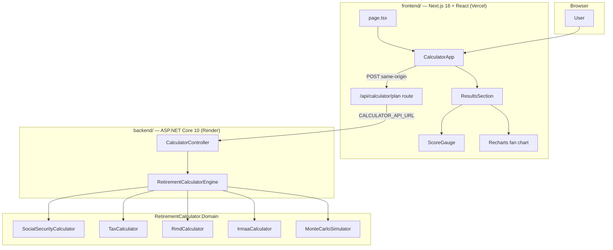

# Retirement Calculator Pro — Architecture

**Product:** [RetireCheck](https://retirecheck-wshi.vercel.app) · **Stack:** Next.js + React (UI) · ASP.NET Core (API) · C# Domain (logic)  
**Agent guide:** `AGENTS.md` · **Cursor rules:** `.cursor/rules/`

---

## 1. Product definition

> US-focused retirement planning calculator: **4-step wizard** (about you, savings/spending, Social Security, assumptions) → results with animated success gauge, Monte Carlo fan chart, SS claiming comparison, downloadable score card, and year-by-year projections.

---

## 2. Architecture



**Rule:** All math lives in `RetirementCalculator.Domain`. React components call the Next.js proxy; controllers delegate to the engine.

---

## 3. Project layout

```
Retirement Calculator/
├── frontend/                          # Next.js 16, TypeScript, Tailwind
│   └── src/
│       ├── app/
│       │   ├── api/calculator/plan/   # Server-side proxy to .NET API
│       │   ├── opengraph-image.tsx    # Social share preview image
│       │   └── globals.css            # Emerald/teal design system
│       ├── components/
│       │   ├── CalculatorApp.tsx      # 4-step wizard + sample plan demo
│       │   ├── ResultsSection.tsx     # Dashboard, tables, fan chart
│       │   ├── ScoreGauge.tsx         # Animated success-rate ring
│       │   ├── ShareCardButton.tsx    # Downloadable PNG score card
│       │   └── WizardProgress.tsx
│       ├── lib/
│       │   ├── api.ts                 # Client → Next.js proxy
│       │   ├── calculatorApiUrl.ts    # Server-only API base URL
│       │   └── format.ts
│       └── types/retirement.ts
│
├── backend/
│   ├── src/
│   │   ├── RetirementCalculator.Api/  # REST API, CORS, DI
│   │   └── RetirementCalculator.Domain/
│   │       ├── Models/
│   │       └── Services/              # Pure calculation logic
│   └── tests/
│       ├── RetirementCalculator.Domain.Tests/
│       └── RetirementCalculator.Api.Tests/
```

---

## 4. API contract

| Method | Path | Body | Response |
|--------|------|------|----------|
| POST | `/api/calculator/plan` | `RetirementPlanInput` (JSON, camelCase) | `RetirementPlanResult` |
| GET | `/api/calculator/fra?birthDate=YYYY-MM-DD` | — | FRA lookup |

**Browser path:** `POST /api/calculator/plan` (Next.js route) → `${CALCULATOR_API_URL}/api/calculator/plan` (Render).

Enums serialize as strings (`Single`, `Married`, `TCJA`, `PreTCJA`).

---

## 5. Domain logic (ported from HTML prototype)

| Module | C# Service |
|--------|-----------|
| SS benefit adjustments | `SocialSecurityCalculator` |
| Breakeven | `SocialSecurityCalculator.GetBreakeven()` |
| RMD | `RmdCalculator` |
| Federal tax | `TaxCalculator` |
| SS taxation | `TaxCalculator.CalculateTaxableSocialSecurity()` |
| IRMAA | `IrmaaCalculator` |
| Monte Carlo (1,000 runs) | `MonteCarloSimulator` |
| Orchestration | `RetirementCalculatorEngine` |

---

## 6. UI features

| Feature | Implementation |
|---------|----------------|
| 4-step wizard | `CalculatorApp.tsx` + `WizardProgress.tsx` |
| One-click sample plan | `buildSampleForm()` in `CalculatorApp.tsx` |
| Animated success gauge | `ScoreGauge.tsx` |
| Monte Carlo fan chart (P10–P90 band) | `ResultsSection.tsx` (Recharts `ComposedChart`) |
| Portfolio / tax / stress charts | `ResultsSection.tsx` |
| Download score card PNG | `ShareCardButton.tsx` |
| Open Graph preview | `opengraph-image.tsx` |
| Recommendations + disclaimer | `ResultsSection.tsx` |
| Excel export | Not yet ported |

---

## 7. Run locally

**Both processes are required** — the frontend proxies to the API.

```powershell
# Terminal 1 — API
cd backend/src/RetirementCalculator.Api
dotnet run --launch-profile http

# Terminal 2 — Frontend
cd frontend
npm install   # first time only
cp .env.example .env.local   # or copy on Windows
npm run dev
```

- App: http://localhost:3000  
- API: http://127.0.0.1:5051  
- Env: `CALCULATOR_API_URL=http://127.0.0.1:5051` in `frontend/.env.local`

---

## 8. Deployment

| Service | Host | Branch | Config |
|---------|------|--------|--------|
| Frontend | Vercel | `main` (production) | `frontend/vercel.json`, `CALCULATOR_API_URL` env var |
| API | Render | `main` | `render.yaml`, Docker |

Live: **https://retirecheck-wshi.vercel.app**

---

## 9. Testing

```bash
cd backend
dotnet test
```

20 tests cover domain logic (SS, FRA, validation) and API integration. CI runs on `dev` and `main` via GitHub Actions.

---

## 10. Backlog

### Done
- [x] 4-step wizard + results with Recharts
- [x] C# domain port (SS, RMD, tax, IRMAA, Monte Carlo)
- [x] Birth-date FRA, step validation, API validation
- [x] Next.js API proxy (no browser → backend CORS popup)
- [x] Vercel frontend + Render API deployment
- [x] UI polish: score gauge, fan chart, sample plan, share card, OG image
- [x] CI + secret-safe gitignore

### Should
- [ ] Excel export
- [ ] Docker Compose for local API + frontend
- [ ] OpenAPI → TypeScript client generation
- [ ] More unit tests (tax brackets, RMD edge cases)

### Won't (for now)
- User accounts / cloud persistence
- Non-US tax rules

---

## 11. Disclaimer

Estimates only. Not financial advice. Link to [SSA.gov](https://www.ssa.gov/planners/retire/) included in results.
