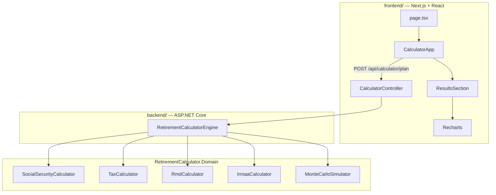

# Retirement Calculator Pro — Architecture

**Stack:** Next.js + React (UI) · ASP.NET Core (API) · C# Domain (logic)  
**Reference:** `Retirement Calculator Pro.html` (design + calculation logic)

---

## 1. Product definition

> US-focused retirement planning calculator: 5-step wizard for personal profile, accounts, income, Social Security, and market/tax settings — with comprehensive results including Monte Carlo, SS claiming comparison, and year-by-year projections.

---

## 2. Architecture



---

## 3. Project layout

```
Retirement Calculator/
├── frontend/                          # Next.js 16, TypeScript, Tailwind
│   └── src/
│       ├── app/                       # Routes, global styles
│       ├── components/
│       │   ├── CalculatorApp.tsx      # 5-step wizard (mirrors HTML)
│       │   ├── ResultsSection.tsx     # Dashboard, tables, charts
│       │   └── WizardProgress.tsx
│       ├── lib/
│       │   ├── api.ts                 # API client
│       │   └── format.ts              # Currency / percent
│       └── types/retirement.ts        # DTOs matching C# models
│
├── backend/
│   ├── src/
│   │   ├── RetirementCalculator.Api/  # REST API, CORS, DI
│   │   └── RetirementCalculator.Domain/
│   │       ├── Models/                # Input / Result records
│   │       └── Services/              # Pure calculation logic
│   └── tests/
│       └── RetirementCalculator.Domain.Tests/
│
└── Retirement Calculator Pro.html     # Original prototype reference
```

**Rule:** All math lives in `RetirementCalculator.Domain`. React components call the API; controllers delegate to the engine.

---

## 4. API contract

| Method | Path | Body | Response |
|--------|------|------|----------|
| POST | `/api/calculator/plan` | `RetirementPlanInput` (JSON, camelCase) | `RetirementPlanResult` |

Enums serialize as strings (`Single`, `Married`, `TCJA`, `PreTCJA`).

---

## 5. Logic ported from HTML prototype

| Module | C# Service | HTML source |
|--------|-----------|-------------|
| SS benefit adjustments | `SocialSecurityCalculator` | `getSocialSecurityBenefit()` |
| Breakeven | `SocialSecurityCalculator.GetBreakeven()` | Fixed cumulative logic |
| RMD | `RmdCalculator` | `RMD_TABLE`, `getRMD()` |
| Federal tax | `TaxCalculator` | `TAX_BRACKETS_2026` |
| SS taxation | `TaxCalculator.CalculateTaxableSocialSecurity()` | `calculateSSIncome()` |
| IRMAA | `IrmaaCalculator` | `calculateIRMAA()` |
| Monte Carlo | `MonteCarloSimulator` | `runMonteCarloSimulation()` |
| Orchestration | `RetirementCalculatorEngine` | `calculatePlan()` |

---

## 6. UI parity with HTML prototype

| HTML feature | React implementation |
|--------------|---------------------|
| 5-step progress bar | `WizardProgress.tsx` |
| Step 1–5 forms | `CalculatorApp.tsx` |
| Dashboard cards | `ResultsSection.tsx` |
| Age / SS comparison tables | `ResultsSection.tsx` |
| Monte Carlo charts | Recharts pie + line |
| Portfolio / tax / stress charts | Recharts |
| Recommendations + disclaimer | `ResultsSection.tsx` |
| Excel export | Not yet ported (v1.1) |

---

## 7. Run locally

```bash
# Terminal 1 — API
cd backend/src/RetirementCalculator.Api
dotnet run --launch-profile http

# Terminal 2 — Frontend
cd frontend
npm install
npm run dev
```

- API: http://localhost:5051  
- App: http://localhost:3000  
- CORS: configured for localhost:3000 in `appsettings.json`

---

## 8. Testing

```bash
cd backend
dotnet test
```

Tests cover SS benefit logic and full engine integration.

---

## 9. Backlog

### Must (next)
- [ ] Input validation on wizard steps (block Next with clear errors)
- [ ] FRA auto-derived from birth date (replace manual dropdown)
- [ ] Excel export (port from HTML SheetJS)

### Should
- [ ] Docker Compose for API + frontend
- [ ] OpenAPI client generation for TypeScript
- [ ] More unit tests (tax brackets, RMD edge cases)

### Won't (for now)
- iOS native app (superseded by web stack per user direction)
- User accounts / cloud persistence

---

## 10. Disclaimer

Estimates only. Not financial advice. Link to [SSA.gov](https://www.ssa.gov/planners/retire/) included in results.
